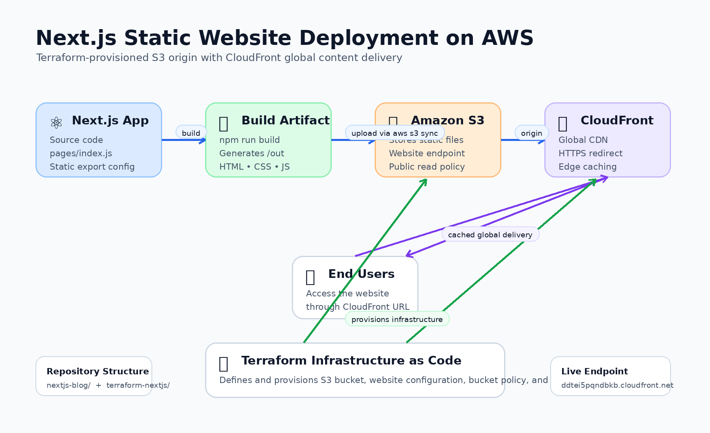

# Terraform Portfolio Website Deployment

## Project Overview

This project demonstrates the deployment of a globally accessible static website using AWS and Infrastructure as Code (IaC).

The solution uses a statically exported Next.js application hosted on Amazon S3 and delivered through Amazon CloudFront, with all infrastructure provisioned and managed using Terraform.

While the technical objective was to deploy a website, the broader engineering objective was to design an architecture that satisfied real business requirements while minimizing operational complexity and cost.

---

## Live Demo

**CloudFront URL**

https://ddtei5pqndbkb.cloudfront.net

---

## Architecture



---

## Business Problem

A freelance web designer needed a hosting solution for a Next.js portfolio website that was:

* Highly Available
* Globally Accessible
* Fast Loading
* Cost Effective
* Scalable

The challenge was determining the simplest architecture capable of meeting those requirements while avoiding unnecessary operational overhead.

---

## Engineering Approach

### Initial Thinking

My first instinct was to think in terms of AWS services:

* EC2
* Elastic Beanstalk
* ECS
* Lambda

However, I realized I was focusing on implementation details before understanding the actual problem.

### First-Principles Analysis

Instead of asking:

> Which AWS services should I use?

I asked:

> What capabilities does the system require?

The website ultimately needed to:

1. Store static files
2. Deliver files globally
3. Scale automatically
4. Minimize costs
5. Require minimal operational maintenance

Once the requirements were identified, the architecture became significantly simpler.

---

## Why S3 + CloudFront?

### Amazon S3

S3 provides:

* Highly durable object storage
* Low operating cost
* Automatic scalability
* Native static website hosting

Since the application was exported as static HTML, CSS, JavaScript, and image files, no application servers were required.

### Amazon CloudFront

CloudFront provides:

* Global edge caching
* Reduced latency
* HTTPS support
* Improved performance
* Protection from traffic spikes

CloudFront sits in front of the S3 bucket and delivers content from edge locations closer to users around the world.

---

## Why I Did Not Use EC2

An EC2-based deployment would have solved the problem, but it would have introduced unnecessary complexity:

* Server management
* Operating system maintenance
* Security patching
* Capacity planning
* Higher costs

Because the workload consists entirely of static files, S3 and CloudFront provide a simpler and more resilient architecture that better aligns with the business requirements.

---

## Solution Architecture

```text
Developer
    |
    v
Next.js Application
    |
    v
npm run build
    |
    v
Static Files (/out)
    |
    v
Amazon S3
    |
    v
CloudFront CDN
    |
    v
Global End Users
```

---

## Repository Structure

```text
terraform-portfolio-project
│
├── architecture/
│   └── nextjs_s3_cloudfront_architecture.png
│
├── docs/
│
├── nextjs-blog/
│
├── terraform-nextjs/
│   ├── providers.tf
│   ├── main.tf
│   ├── outputs.tf
│   └── .terraform.lock.hcl
│
└── README.md
```

---

## Technologies Used

* AWS S3
* AWS CloudFront
* Terraform
* Next.js
* Git
* GitHub
* AWS CLI

---

## Terraform Resources Provisioned

### Amazon S3 Bucket

Purpose:

* Static website storage

### S3 Website Configuration

Purpose:

* Configure index and error pages

### S3 Bucket Policy

Purpose:

* Public read access for website assets

### CloudFront Distribution

Purpose:

* Global content delivery and caching

---

## Deployment Workflow

### Build Application

```bash
npm run build
```

### Provision Infrastructure

```bash
terraform init
terraform plan
terraform apply
```

### Upload Website Assets

```bash
aws s3 sync ./out s3://bucket-name
```

### Retrieve CloudFront URL

```bash
terraform output cloudfront_url
```

---

## Lessons Learned

### Technical Lessons

* Terraform state management is critical to infrastructure consistency.
* CloudFront deployments take significantly longer than most AWS resources.
* S3 Block Public Access settings can prevent public bucket policies.
* Infrastructure changes should always be validated before deployment.

### Engineering Lessons

The most valuable lesson from this project was learning to think about systems instead of services.

Initially, I approached the challenge by trying to determine which AWS services to deploy.

A more effective approach was to identify the required system capabilities first and then select the services that best satisfied those requirements.

This shift from service-first thinking to requirement-first thinking significantly simplified the solution and reinforced the value of first-principles analysis in cloud architecture.

---

## Skills Demonstrated

* AWS Architecture
* Terraform
* Infrastructure as Code
* CloudFront
* Amazon S3
* Git & GitHub
* Systems Thinking
* Cloud Engineering
* Requirements Analysis
* First-Principles Problem Solving

## Additional Documentation
- [CI/CD Pipeline Documentation](./docs/cicd-pipeline.md)


## CI/CD Pipeline

This project now includes a GitHub Actions CI/CD pipeline that:

- Builds the Next.js application
- Deploys static assets to Amazon S3
- Invalidates CloudFront cache
- Updates production automatically on every push to main

---

# Project Screenshots

## Architecture Design

The solution uses Amazon S3 for static website hosting, Amazon CloudFront for global content delivery, Terraform for Infrastructure as Code, and GitHub Actions for CI/CD automation.


---

## Terraform Project Structure

Infrastructure was provisioned and managed using Terraform.


---

## CloudFront Configuration

Amazon CloudFront provides low-latency global content delivery and edge caching.


---

## Automated CI/CD Pipeline

Code changes pushed to GitHub automatically trigger the deployment workflow.


---

## Live Website Deployment

Final production deployment delivered through CloudFront.


---

## Author

Ismail Abdur-Rahman

Business Analyst | Cloud Engineering Student | Cloud Architecture Enthusiast
