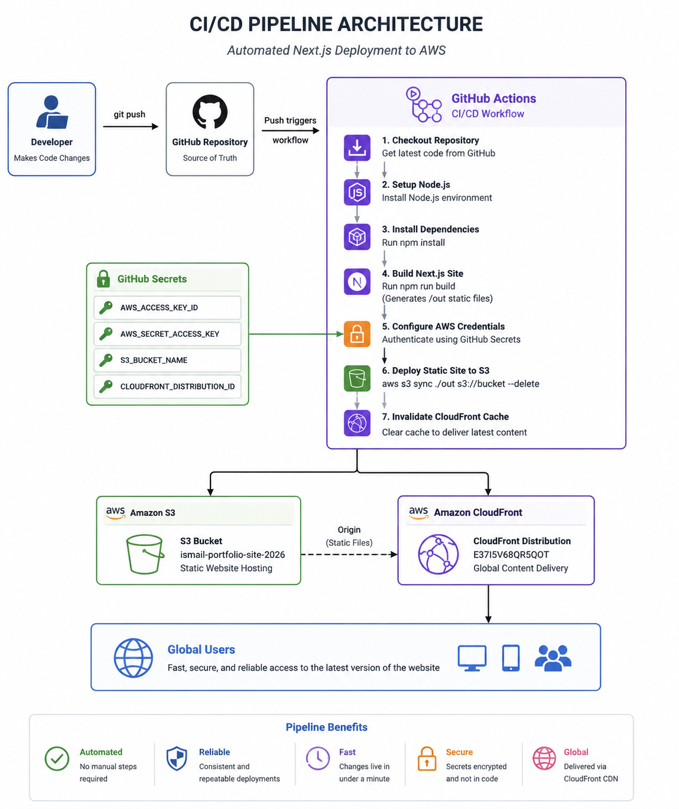
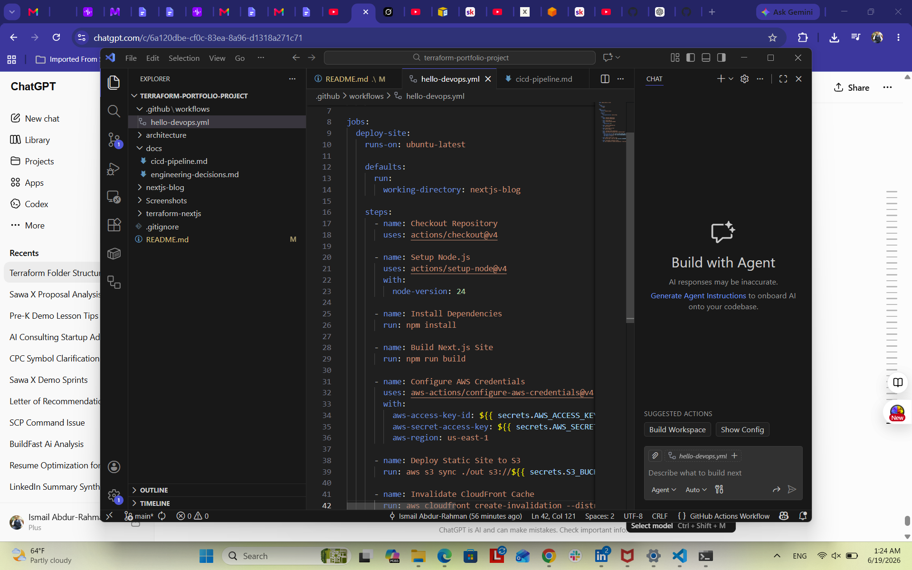
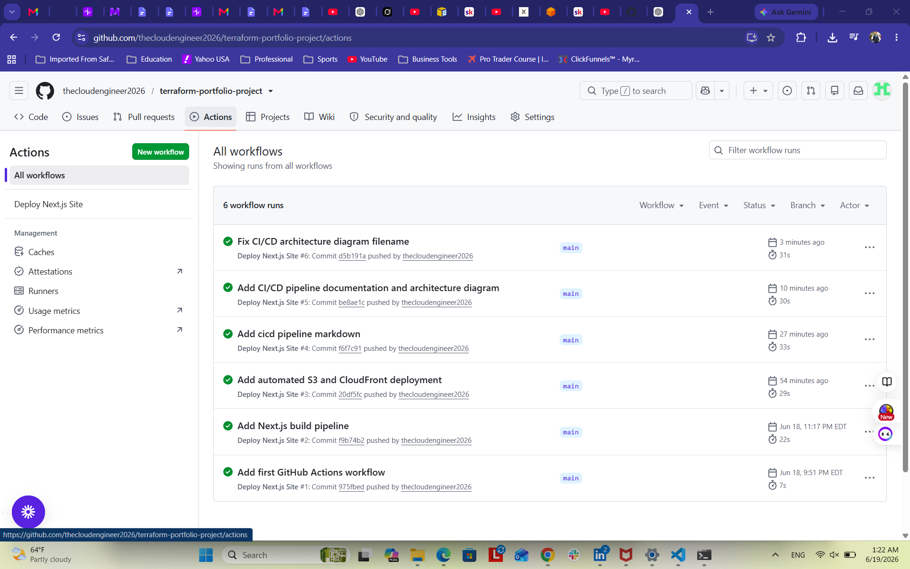

CI/CD Pipeline Documentation
Project Overview

## CI/CD Architecture

This project extends the Terraform Portfolio Website Deployment project by implementing a Continuous Integration and Continuous Deployment (CI/CD) pipeline using GitHub Actions.

The objective was to automate the software delivery process so that code changes could be validated, built, and deployed without manual intervention.

Business Problem

Initially, website deployments were performed manually.

The process required:

Building the Next.js application locally
Exporting static files
Uploading files to Amazon S3
Invalidating the CloudFront cache

While functional, this approach introduced several risks:

Human error
Inconsistent deployments
Longer release times
Lack of repeatability
Increased operational overhead

The goal was to create an automated deployment pipeline that would execute the same process consistently every time code was pushed to the repository.

First-Principles Analysis

My initial thought was:

"How do I learn GitHub Actions?"

However, this focused on the tool rather than the problem.

Applying first-principles thinking, I reframed the question:

"What capability does the business require?"

The business requirement was not GitHub Actions.

The business requirement was:

Reliable deployments
Repeatable deployments
Reduced operational effort
Faster delivery

Once the requirements were identified, GitHub Actions became a natural implementation choice.

CI/CD Architecture
Developer
    ↓
Git Push
    ↓
GitHub Repository
    ↓
GitHub Actions Workflow
    ↓
Install Dependencies
    ↓
Build Next.js Application
    ↓
Authenticate to AWS
    ↓
Deploy Static Files to S3
    ↓
Invalidate CloudFront Cache
    ↓
Updated Website Available Globally
Workflow Components
Source Control

GitHub serves as the source-of-truth repository.

All code changes are committed and pushed to GitHub.

Continuous Integration (CI)

The workflow automatically performs:

Repository checkout
Node.js installation
Dependency installation
Next.js build validation

This ensures that the application can be successfully built before deployment occurs.

Continuous Deployment (CD)

After a successful build:

AWS credentials are securely loaded from GitHub Secrets.
Static files are synchronized to the S3 bucket.
CloudFront cache is invalidated.
Users receive the latest version of the website.
GitHub Secrets

Sensitive information is stored using GitHub Actions Secrets.

Secrets used:

Secret	Purpose
AWS_ACCESS_KEY_ID	AWS Authentication
AWS_SECRET_ACCESS_KEY	AWS Authentication
S3_BUCKET_NAME	Deployment Target
CLOUDFRONT_DISTRIBUTION_ID	Cache Invalidation

This prevents credentials from being exposed in source code.

Workflow File

Location:

.github/workflows/hello-devops.yml

Key stages:

Checkout Repository
Setup Node.js
Install Dependencies
Build Next.js Site
Configure AWS Credentials
Deploy Static Site to S3
Invalidate CloudFront Cache
Deployment Results

Successful workflow execution demonstrates:

Automated build validation
Automated deployment
Automated cache invalidation
Repeatable release process

Deployment time:

Approximately 25 seconds.

Lessons Learned
Lesson 1

CI/CD is not about GitHub Actions.

CI/CD is about creating reliable software delivery systems.

Lesson 2

Automation reduces operational risk.

Every manual step is a potential failure point.

Lesson 3

Cloud engineering requires systems thinking.

The important question is not:

"Which tool should I use?"

The important question is:

"What capability does the system require?"

Future Improvements

Potential enhancements include:

Pull Request validation workflows
CloudFormation validation workflows
Terraform validation workflows
Multi-environment deployments
Approval gates
Automated rollback strategies
Security scanning
Unit testing
Final Reflection

This project reinforced a key lesson from the Cloud Engineer Academy:

Infrastructure is important.

Automation is important.

However, the most valuable skill is learning to reason from first principles and design systems that solve business problems rather than simply implementing technologies.

## GitHub Actions Workflow

The deployment pipeline is defined using GitHub Actions and executes automatically whenever changes are pushed to the main branch.

Key stages include:

- Repository checkout
- Node.js environment setup
- Dependency installation
- Next.js build process
- AWS authentication via GitHub Secrets
- Deployment to Amazon S3
- CloudFront cache invalidation

## Successful Pipeline Execution

After configuration of GitHub Actions and AWS credentials, the pipeline successfully completed all deployment stages automatically.

This validated the complete CI/CD workflow from source control through production deployment.

